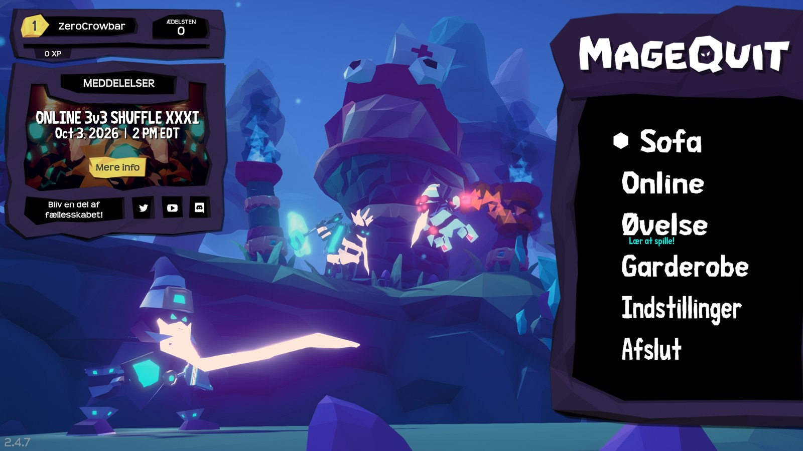
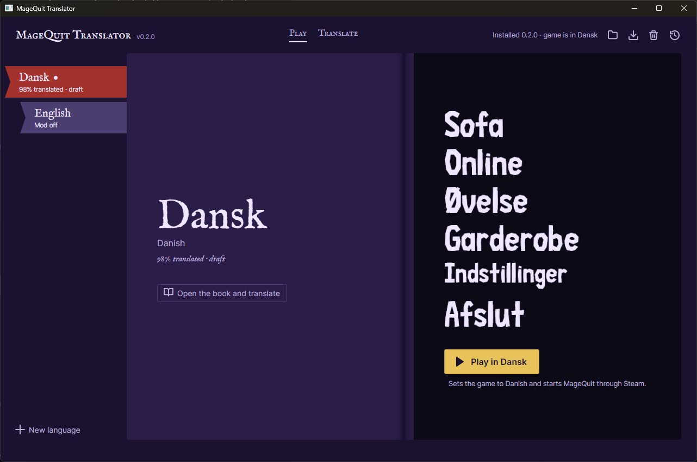
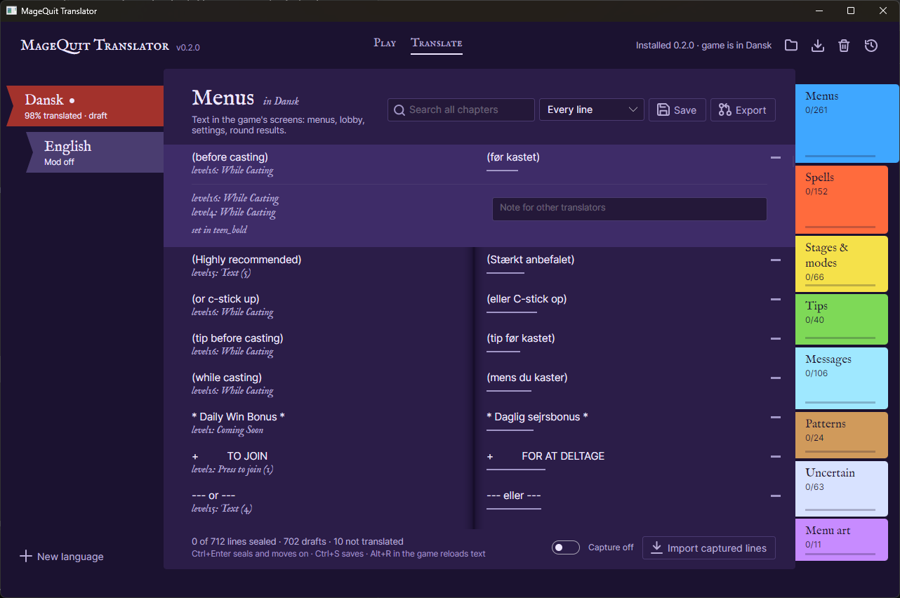
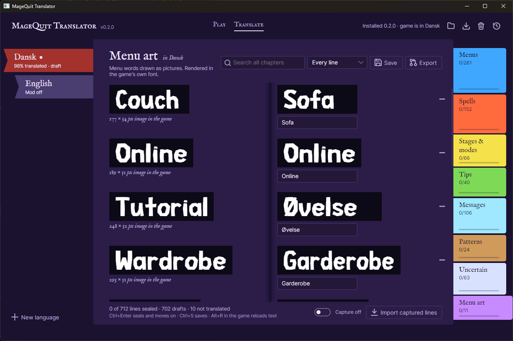
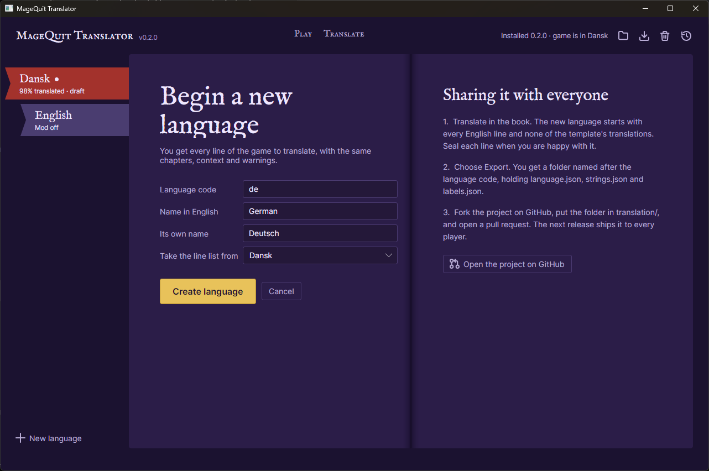

# MageQuit Translator

Play [MageQuit](https://store.steampowered.com/app/572220/MageQuit/) in your own language: menus, spell descriptions, tips and the menu art. A small companion app installs the translation, switches between languages, and removes it again, restoring the game byte for byte.


*The real game with the Danish translation. The image buttons (Sofa, Øvelse, Garderobe …) are redrawn in the game's own font, including letters the game's fonts never had.*

Anyone can add a language. See [CONTRIBUTING.md](CONTRIBUTING.md).

| Language | Folder | State |
|---|---|---|
| Dansk (Danish) | [`translation/da`](translation/da) | Full first draft (702 of 712 lines), checked in game |

*Unofficial fan project, not affiliated with Bowlcut Studios. MageQuit is © Bowlcut Studios.*

## The app

| | |
|---|---|
|  |  |
| **Play.** Pick a language ribbon and press Play. The right page previews the game's main menu in that language. | **Translate.** English on the left page, the translation on the right, line by line. Each line shows where it appears in the game, a length check, warnings, and a seal once it has been reviewed. |
|  |  |
| **Menu art.** Buttons the game draws as pictures are re-rendered in the game's own font as you type. | **New language.** Starts a language with every line of the game, ready to translate and export for a pull request. |

## Install

1. Download `MageQuit-Translator-<version>-win-x64.zip` (or `-linux-x64.zip`) from [Releases](../../releases) and unzip it anywhere. It is a single program; nothing gets installed on your PC.
2. Run `MageQuit-Translator.exe`. It finds MageQuit through Steam; if it doesn't, choose the folder that holds `MageQuit.exe`.
3. Choose **Install the translator**, pick your language's ribbon, and press **Play in …**.

- **Change language:** pick another ribbon and press Play. The **English** ribbon turns the translation off without uninstalling.
- **Update or repair:** the download icon at the top right. Your own edits are kept.
- **Uninstall:** the trash-can icon at the top right. Every game file is restored to the original.
- **In game:** Alt+T switches between translated and original text, Alt+R reloads the text after you edit it, and F11 saves a screenshot to `BepInEx/MageQuit-Translator/screenshots`.
- **Steam Deck / Linux:** set `WINEDLLOVERRIDES="winhttp=n,b" %command%` as MageQuit's launch option in Steam (the app shows it with a copy button). The Linux build is provided but not yet tested; reports are welcome.

Upgrading from 0.1.0 (MageQuit-DA)? Uninstall it with its own app first.

## What it changes on your PC

- **Adds** [BepInEx](https://github.com/BepInEx/BepInEx) (the standard Unity mod loader: `winhttp.dll`, `doorstop_config.ini`, the `BepInEx` folder) and the translation files to the MageQuit folder. No game code is modified.
- **Patches** two font entries in `MageQuit_Data/resources.assets` and `sharedassets1.assets` to add accented letters. The patch is appended to the files, and uninstalling cuts it off again, so the files return to their exact original bytes.
- **Nothing else.** No network access; the app only opens links to this page when you click them. The translation only changes what you see. Other players don't need it, and nothing is sent to them.
- Steam's *Verify integrity of game files* undoes the font patch. Choose Update or repair in the app afterwards.

---

## How it works

MageQuit is Unity 2018.4 (Mono), and all of its English text is hardcoded. There are about 1,400 UGUI `Text` components in scenes and prefabs, string literals in `Assembly-CSharp.dll`, and 11 menu words drawn as images.

| Piece | What it does |
|---|---|
| [BepInEx 5](https://github.com/BepInEx/BepInEx) | Mod loader, injected via `winhttp.dll`. |
| [XUnity.AutoTranslator](https://github.com/bbepis/XUnity.AutoTranslator) | Replaces text at runtime from `BepInEx/Translation/<code>/Text/MageQuit.txt`, and the menu art from `…/Texture/`. |
| `src/MageQuitTranslator.Plugin` | Small BepInEx plugin. *Capture mode* records every UI string with its scene, path and font to `captured.tsv`; F11 takes screenshots. |
| Font patch | `MageQuit-Body` and `MageQuitHeaderThin` lack accented letters. `tools/fonts/build_glyphs.py` composes À–ÿ from each font's own glyphs: Æ = A+E, Ø = O+/, rings and accents from the font's punctuation. The installer appends the patched `Font` object to the asset file and repoints its entry in the object table. Only a delta ships, not the game's fonts. `fonts.json` lists which characters each game font can show, which drives the app's warnings. |
| `src/MageQuitTranslator.Core` | Install, update and uninstall via a manifest; language packs; font patcher; XUnity export; label renderer (SkiaSharp, drawing in the patched game font). |
| `src/MageQuitTranslator.Manager` | The app: an Avalonia GUI plus a CLI (`--install`, `--uninstall`, `--language <code\|off>`, `--status`). |

Each player's working copies live in `BepInEx/MageQuit-Translator/languages/<code>/`. On update they are merged with the shipped versions, and lines the player edited win.

### Building

```powershell
./build/package.ps1                          # plugin + payload + single-file app for win-x64 and linux-x64 → dist/
./build/package.ps1 -StageOnly               # just dist/payload, enough to run the app from source
dotnet test --project tests/MageQuitTranslator.Tests
```

Requires the .NET 10 SDK. Everything builds without the game installed. The plugin's Unity references come from the BepInEx NuGet feed (`nuget.config`).

### Rebuilding the string list (needs the game)

```sh
pip install UnityPy TypeTreeGeneratorAPI fonttools pillow
ilspycmd -p -o decomp "<game>/MageQuit_Data/Managed/Assembly-CSharp.dll"
python tools/extract/extract_assets.py "<game>" assets.json   # UI Text/TMP + Spell.description etc.
python tools/extract/extract_code.py decomp code.json         # string literals + enum display names
python tools/extract/build_candidates.py assets.json code.json translation   # adds new strings to every language
python tools/fonts/make_font_patch.py build "<game>" payload/game/BepInEx/MageQuit-Translator/fontpatch.json
python tools/fonts/font_coverage.py "<game>" payload/game/BepInEx/MageQuit-Translator/fonts.json
```

### Licenses

The project is MIT. It bundles BepInEx (LGPL-2.1) and XUnity.AutoTranslator (MIT), whose licenses are installed to `BepInEx/MageQuit-Translator/licenses`, and IM FELL English by Igino Marini (SIL OFL, `src/MageQuitTranslator.Manager/Assets/Fonts/OFL.txt`).
